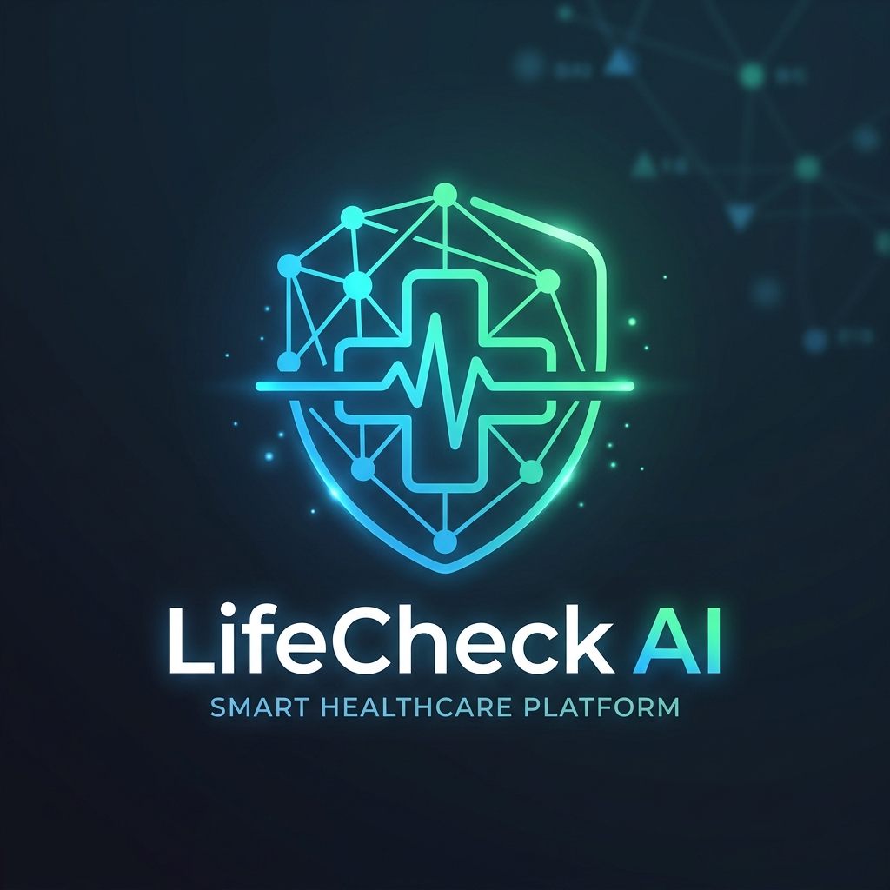

<p align="center">
  
</p>

<h1 align="center">🏥 LifeCheck AI</h1>

<p align="center">
  <strong>AI-Powered Multi-Disease Health Risk Prediction & Screening Platform</strong>
</p>

<p align="center">
  <em>Predict. Protect. Prevent — Harnessing the power of Machine Learning, Deep Learning & Explainable AI to democratize healthcare screening.</em>
</p>

<p align="center">
  
  
  
  
  
  
  
</p>

<p align="center">
  <a href="#-features">Features</a> •
  <a href="#-system-architecture">Architecture</a> •
  <a href="#-machine-learning-models">Models</a> •
  <a href="#-installation--setup">Installation</a> •
  <a href="#-usage-guide">Usage</a> •
  <a href="#-contributors">Team</a>
</p>

---

## 📖 Project Overview

**LifeCheck AI** is a comprehensive, production-grade healthcare screening platform that leverages Artificial Intelligence to predict multiple critical health risks. Built as a graduation project in Software Engineering & AI, the platform combines classical Machine Learning, Deep Learning, and Natural Language Processing into a single, unified system.

### 🎯 What It Does

- 🩸 **Diabetes Screening** — Predicts diabetes risk from 14 behavioral & clinical indicators using XGBoost
- ❤️ **Heart Disease Screening** — Analyzes 16 lifestyle & medical factors using Random Forest
- 🫁 **Lung Cancer Detection** — Classifies chest X-ray images using EfficientNetB0 with **Grad-CAM visual explainability**
- 🤖 **Medical Chatbot** — A safe, RAG-grounded AI assistant with emergency detection and a 7-stage NLP pipeline
- 🔐 **Secure Patient Portal** — JWT authentication, medical record history, and PDF report export

> [!NOTE]
> LifeCheck AI is designed for **preliminary screening and educational purposes only**. It is not a substitute for professional medical diagnosis.

---

## ✨ Features

| Feature | Description |
|:---|:---|
| 🎯 **Multi-Disease AI Prediction** | Three independently trained models for Diabetes, Heart Disease, and Lung Cancer |
| 🔍 **Explainable AI (Grad-CAM)** | Visual heatmaps overlaid on X-rays showing exactly *where* the model detected abnormalities |
| 🧠 **8-Layer Activation Visualization** | Sequential CNN layer outputs showing how the model progressively "sees" chest tissue |
| 🤖 **Safe Medical Chatbot** | 7-stage NLP pipeline: Language Detection → Safety Guard → Symptom Extraction → Memory → Triage → RAG → Response |
| 🔐 **JWT Authentication** | Secure register/login with Bcrypt password hashing and 7-day token expiry |
| 📋 **Patient Medical Records** | Full prediction history stored per user in SQLite with SQLAlchemy ORM |
| 📄 **PDF Report Export** | Download formatted medical reports for doctor consultations |
| 🎨 **Premium UI** | Custom CSS glassmorphism design, dark/light mode, floating chatbot button with pulse animation |
| 📊 **Probability Scoring** | Confidence percentages with `predict_proba()` — not just binary yes/no |
| 🚀 **One-Click Launch** | `Start_LifeCheck_AI.bat` auto-starts backend, waits for model loading, then launches frontend |
| 🐳 **Docker Support** | Containerized deployment via included Dockerfile |
| 🌍 **Bilingual Chatbot** | Supports English and Arabic language interactions |

---

## 🏗 System Architecture

```
┌──────────────────────────────────────────────────────────────────┐
│                        USER (Browser)                            │
└───────────────────────────┬──────────────────────────────────────┘
                            │
                   ┌────────▼────────┐
                   │   Streamlit UI   │
                   │   (frontend/)    │
                   │  Glassmorphism   │
                   │  + Dark Mode     │
                   └────────┬────────┘
                            │ HTTP Requests
                   ┌────────▼────────┐
                   │  FastAPI Server  │
                   │  (Port 8000)     │
                   │  + CORS + JWT    │
                   └────────┬────────┘
                            │
        ┌───────────┬───────┼───────┬────────────┐
        │           │       │       │            │
   ┌────▼────┐ ┌───▼───┐ ┌─▼──┐ ┌──▼───┐ ┌─────▼─────┐
   │Diabetes │ │ Heart │ │Lung│ │ Chat │ │   Auth    │
   │XGBoost  │ │  RF   │ │CNN │ │ Bot  │ │  + Patient│
   └────┬────┘ └───┬───┘ └─┬──┘ └──┬───┘ └─────┬─────┘
        │          │       │       │            │
        │     ┌────▼───────▼───────▼───┐        │
        │     │ Pydantic Validation    │        │
        │     │ (Schemas Layer)        │        │
        │     └────────────┬───────────┘        │
        │                  │                    │
        └──────────────────▼────────────────────┘
                           │
                  ┌────────▼────────┐
                  │  SQLite Database │
                  │  (SQLAlchemy)    │
                  │  Users + Records │
                  └─────────────────┘
```

<details>
<summary><strong>📊 ML Pipeline Workflow</strong></summary>

```
Patient Data (Form / X-Ray Image)
        │
        ▼
┌─────────────────┐
│ Data Validation  │  ← Pydantic schemas enforce strict input types
│ (prediction_     │
│  schema.py)      │
└────────┬────────┘
         ▼
┌─────────────────┐
│ Feature          │  ← Age mapping, health encoding, gender binarization
│ Engineering      │
│ (model files)    │
└────────┬────────┘
         ▼
┌─────────────────┐
│ Model Inference  │  ← predict_proba() for tabular / predict() for CNN
│ (Cached Models)  │
└────────┬────────┘
         ▼
┌─────────────────┐
│ Post-Processing  │  ← Risk level assignment, Grad-CAM generation,
│ + Explainability │    recommendation text
└────────┬────────┘
         ▼
┌─────────────────┐
│ JSON Response    │  ← {prediction, confidence, risk_level, heatmap}
│ to Frontend      │
└─────────────────┘
```

</details>

<details>
<summary><strong>🤖 Chatbot Pipeline (7 Stages)</strong></summary>

```
Patient Message
      │
      ▼
1. 🌐 Language Detection    → Detect Arabic / English
      │
      ▼
2. 🛡️ Safety Guardrail      → Scan for emergency keywords
      │                        (bleeding, stroke, suicide)
      ▼                        → If critical: INSTANT emergency reply
3. 🔬 Symptom Extraction    → Parse positive & negative symptoms
      │                        "headache but no fever" → {+headache, -fever}
      ▼
4. 🧠 Session Memory        → Accumulate symptoms per user_id
      │
      ▼
5. 🏥 Medical Triage        → Match symptoms vs conditions.json
      │                        Consider patient profile (BMI, age)
      ▼
6. 📚 RAG Search            → Retrieve evidence from medical_kb.json
      │
      ▼
7. ✍️ Response Composition   → Generate safe, grounded, non-hallucinated reply
```

</details>

---

## 🛠 Technologies Used

| Technology | Version | Purpose |
|:---|:---|:---|
|  | 3.10+ | Core programming language |
|  | Latest | High-performance REST API backend |
|  | Latest | Interactive frontend web application |
|  | 2.15 | Deep Learning (EfficientNetB0 for lung cancer) |
|  | ≥1.8 | Machine Learning (Random Forest, pipelines) |
|  | Latest | Gradient Boosting for diabetes prediction |
|  | ≥3.0 | Data manipulation and preprocessing |
|  | ≥2.4 | Numerical computing and matrix operations |
|  | Latest | Image processing, Grad-CAM visualization |
|  | 3 | Lightweight patient database |
|  | — | Secure authentication tokens |
|  | Latest | Containerized deployment |
|  | CPU | Vector similarity search for RAG chatbot |

---

## 🧬 Machine Learning Models

### 🩸 Diabetes Prediction — XGBoost Classifier

| Attribute | Details |
|:---|:---|
| **Algorithm** | XGBoost (Gradient Boosting) |
| **Input** | 14 clinical & behavioral features |
| **Features** | HighBP, HighChol, BMI, Smoker, Stroke, HeartDisease, PhysActivity, HvyAlcohol, GenHlth, DiffWalk, PhysHlth, Sex, AgeCategory, MentHlth |
| **Output** | Risk probability (0–100%), risk level, personalized recommendation |
| **Model File** | `diabetes_disease_xgb_model.joblib` (~21 KB) |

### ❤️ Heart Disease Prediction — Random Forest Classifier

| Attribute | Details |
|:---|:---|
| **Algorithm** | Random Forest (Ensemble Learning) |
| **Input** | 16 lifestyle & medical history features |
| **Features** | BMI, Smoking, AlcoholDrinking, Stroke, PhysicalHealth, MentalHealth, DiffWalking, Sex, AgeCategory, Diabetic, PhysicalActivity, GenHealth, SleepTime, Asthma, KidneyDisease, SkinCancer |
| **Output** | Risk probability, risk level, recommendation |
| **Model File** | `heart_disease_rf_model.joblib` (~8.5 MB) |
| **Key Technique** | SMOTE for class balancing |

### 🫁 Lung Cancer Detection — EfficientNetB0 (Deep Learning)

| Attribute | Details |
|:---|:---|
| **Architecture** | EfficientNetB0 (ImageNet pre-trained) + Custom Classification Head |
| **Input** | 224×224 RGB chest X-ray images |
| **Training** | Phase 1: Frozen backbone (LR=1e-3) → Phase 2: Fine-tune top 50% (LR=5e-6) |
| **XAI** | Production-grade Grad-CAM with medical-grade alpha overlay |
| **Model File** | `lung_model.h5` (~41 MB) |

<details>
<summary><strong>🔍 Grad-CAM — Explainable AI Details</strong></summary>

The lung cancer model doesn't just classify — it **explains its reasoning** visually:

1. Extracts gradient-weighted class activation maps from `top_activation` layer
2. Generates a 7×7 spatial heatmap → upscaled to 224×224 with Gaussian smoothing
3. Applies JET colormap: **Red** = suspicious tissue, **Blue** = normal tissue
4. Creates a medical overlay: original X-ray blended with heatmap at 60% alpha
5. Additionally generates **8 sequential activation maps** showing how the CNN processes the image layer by layer

**Technical fixes implemented:**
- `tf.gather()` for safe tensor indexing (avoids gradient computation bugs)
- Vectorized matrix multiply `(7,7,1280) @ (1280,)` instead of slow Python loops
- Removed `cv2.equalizeHist` which was destroying spatial localization

</details>

---

## 🚀 Installation & Setup

### Prerequisites

- Python 3.10 or higher
- pip (Python package manager)
- Git

### Step 1: Clone the Repository

```bash
git clone https://github.com/your-username/Life-Check-Ai.git
cd Life-Check-Ai
```

### Step 2: Create a Virtual Environment

```bash
python -m venv venv

# Windows
venv\Scripts\activate

# macOS / Linux
source venv/bin/activate
```

### Step 3: Install Dependencies

```bash
pip install -r requirements.txt
```

### Step 4: Run the Application

**Option A — One-Click Launch (Windows):**
```bash
Start_LifeCheck_AI.bat
```
This will automatically start the backend, wait for models to load, and launch the frontend.

**Option B — Manual Launch:**
```bash
# Terminal 1: Start the backend
uvicorn app.main:app --host 0.0.0.0 --port 8000

# Terminal 2: Start the frontend
streamlit run frontend/app.py
```

**Option C — Docker:**
```bash
docker build -t lifecheck-ai .
docker run -p 8000:8000 -p 8501:8501 lifecheck-ai
```

<details>
<summary><strong>⚡ GPU Setup (Optional — for faster lung model inference)</strong></summary>

If you have an NVIDIA GPU and want accelerated deep learning:

```bash
# Replace tensorflow-cpu with full tensorflow
pip uninstall tensorflow-cpu
pip install tensorflow[and-cuda]
```

Ensure you have CUDA Toolkit and cuDNN installed. See the [TensorFlow GPU guide](https://www.tensorflow.org/install/pip).

</details>

---

## 📁 Repository Structure

```
Life-Check-Ai/
│
├── 📂 app/                          # Backend application
│   ├── main.py                      # FastAPI entry point & router registration
│   ├── 📂 routes/                   # API endpoints
│   │   ├── auth.py                  # POST /auth/register & /auth/login (JWT)
│   │   ├── diabetes.py              # POST /predict/diabetes
│   │   ├── heart.py                 # POST /predict/heart
│   │   ├── lung.py                  # POST /predict/lung (+ Grad-CAM)
│   │   ├── chat.py                  # POST /chat
│   │   └── patient.py               # Patient records & profile management
│   ├── 📂 models/                   # ML/DL model files & inference logic
│   │   ├── diabetes_model.py        # XGBoost inference + feature engineering
│   │   ├── heart_model.py           # Random Forest inference + mappings
│   │   ├── lung_model.py            # Legacy placeholder
│   │   ├── *.joblib / *.h5          # Serialized trained models
│   │   └── classes.txt              # Lung cancer class labels
│   ├── 📂 schemas/                  # Pydantic request/response models
│   │   ├── prediction_schema.py     # DiabetesReq, HeartReq, PredictionRes
│   │   ├── auth.py                  # UserCreate, UserLogin, Token
│   │   └── chat_schema.py           # ChatReq, ChatRes
│   ├── 📂 services/                 # Business logic layer
│   │   ├── prediction_service.py    # Routes → Model connector
│   │   └── chat_service.py          # 7-stage chatbot pipeline orchestrator
│   ├── 📂 chatbot_engine/           # NLP chatbot components
│   │   ├── safety.py                # Emergency keyword detection
│   │   ├── extractor.py             # Symptom extraction (positive/negative)
│   │   ├── triage.py                # Symptom → Disease matching
│   │   ├── rag.py                   # Retrieval-Augmented Generation search
│   │   ├── embeddings.py            # Text → vector embeddings
│   │   ├── generator.py             # Response composition
│   │   ├── matcher.py               # Fuzzy symptom matching
│   │   ├── llm.py                   # LLM connector
│   │   ├── config.py                # Chatbot configuration
│   │   └── utils_language.py        # Language detection
│   ├── 📂 db/                       # Database layer
│   │   ├── database.py              # SQLAlchemy engine & session
│   │   └── models.py                # User & MedicalRecord ORM models
│   ├── 📂 data/                     # Datasets & knowledge bases
│   │   ├── diabetes_prediction_dataset.csv
│   │   ├── heart_data.csv
│   │   ├── 📂 lung cancer dataset/  # X-ray image dataset
│   │   ├── conditions.json          # Disease conditions database
│   │   ├── medical_kb.json          # Medical knowledge base (RAG)
│   │   ├── symptom_lexicon.json     # Symptom vocabulary
│   │   └── lifecheck.db             # SQLite database file
│   └── 📂 training_scripts/         # Jupyter notebooks & training code
│
├── 📂 frontend/                     # Streamlit frontend application
│   ├── app.py                       # Main UI (600+ lines, CSS, routing)
│   ├── 📂 components/               # UI components
│   │   ├── auth_ui.py               # Login / Register screens
│   │   ├── forms.py                 # Disease prediction input forms
│   │   ├── chat_ui.py               # Chatbot dialog interface
│   │   ├── settings.py              # Account settings page
│   │   └── uploader.py              # X-ray image uploader
│   ├── 📂 services/                 # Frontend services
│   │   ├── api_client.py            # HTTP client for backend API
│   │   └── pdf_generator.py         # Medical report PDF creation
│   ├── 📂 static/                   # Static assets (logo)
│   └── 📂 assets/                   # Icons (bot avatar)
│
├── 📂 .streamlit/
│   └── config.toml                  # Streamlit theme configuration
│
├── Dockerfile                       # Docker container configuration
├── requirements.txt                 # Python dependencies
├── run.py                           # Uvicorn server launcher
├── Start_LifeCheck_AI.bat           # One-click Windows launcher
└── README.md                        # This file
```

---

## 📖 Usage Guide

### 1️⃣ Register / Login
Create an account with username, email, and password. Authentication is handled via JWT tokens with Bcrypt-hashed passwords.

### 2️⃣ Select a Health Check
Choose from the dashboard: **Diabetes**, **Heart Disease**, or **Lung Cancer** screening.

### 3️⃣ Enter Patient Data
- **Diabetes / Heart:** Fill in the clinical questionnaire (BMI, age, lifestyle factors, medical history)
- **Lung Cancer:** Upload a chest X-ray image (JPG/PNG)

### 4️⃣ View AI Results
- **Risk Level:** High or Low
- **Confidence Score:** Probability percentage
- **Recommendation:** Personalized medical advice
- **Grad-CAM Heatmap** *(lung only)*: Visual overlay showing suspicious regions

### 5️⃣ Chat with AI Assistant
Click the floating chatbot button → describe your symptoms → receive a safe, RAG-grounded medical response.

### 6️⃣ Export Reports
Download your results as a formatted **PDF medical report** for your doctor.

---

## 📸 Screenshots

<p align="center">
  <em>Screenshots will be added here</em>
</p>

| Screen | Preview |
|:---|:---|
| **Login Page** | *📸 Screenshot Placeholder* |
| **Dashboard** | *📸 Screenshot Placeholder* |
| **Diabetes Prediction Form** | *📸 Screenshot Placeholder* |
| **Heart Disease Results** | *📸 Screenshot Placeholder* |
| **Lung X-Ray + Grad-CAM Heatmap** | *📸 Screenshot Placeholder* |
| **Medical Chatbot** | *📸 Screenshot Placeholder* |
| **PDF Report** | *📸 Screenshot Placeholder* |

---

## ⚡ Challenges & Solutions

| Challenge | Solution |
|:---|:---|
| **Imbalanced medical datasets** (healthy patients >> sick patients) | Applied SMOTE resampling via `imbalanced-learn` to balance training classes |
| **Streamlit UI limitations** (default design is plain) | Injected complex custom CSS: glassmorphism, dark mode, floating elements, pulse animations |
| **Chatbot hallucination risk** (LLMs can give dangerous medical advice) | Built a 7-stage constrained pipeline with safety guardrails, RAG grounding, and triage logic |
| **Grad-CAM gradient bugs** (tensor indexing issues in TensorFlow) | Used `tf.gather()` for safe class selection + vectorized matrix operations |
| **Slow model loading** (large .h5 and .joblib files) | Implemented in-memory model caching — models load once, serve all subsequent requests instantly |
| **Frontend-backend CORS** (different ports for Streamlit and FastAPI) | Configured `CORSMiddleware` with permissive origins for local development |
| **Medical image overlay quality** | Replaced `equalizeHist` with custom alpha-masked blending for diagnostic-grade heatmaps |

---

## 🔮 Future Improvements

| Enhancement | Description |
|:---|:---|
| 📱 **Mobile Application** | Native iOS/Android app consuming the existing REST API |
| ☁️ **Cloud Deployment** | Migrate to AWS/Azure/GCP for scalable, always-on hosting |
| 🧠 **More Disease Models** | Add brain tumor, skin cancer, and kidney disease prediction |
| ⌚ **IoT Wearable Integration** | Real-time monitoring via smartwatch heart rate and glucose data |
| 🗄️ **PostgreSQL Migration** | Replace SQLite with production-grade relational database |
| 🔬 **SHAP Explainability** | Add SHAP values for tabular model interpretability alongside Grad-CAM |
| 📊 **Analytics Dashboard** | Population-level health trend analytics for healthcare providers |
| 🌐 **Expanded Language Support** | Add more languages beyond English and Arabic |

---

## 👥 Contributors

<table>
  <tr>
    <td align="center">
      <strong>Member 1</strong><br/>
      <sub>Diabetes Model & Frontend Lead</sub><br/>
      <sub>XGBoost model, Streamlit UI (600+ lines), CSS design, API client, PDF reports</sub>
    </td>
    <td align="center">
      <strong>Member 2</strong><br/>
      <sub>Heart Disease & Backend Lead</sub><br/>
      <sub>Random Forest model, SQLite DB, JWT auth, patient management, FastAPI setup</sub>
    </td>
    <td align="center">
      <strong>Member 3</strong><br/>
      <sub>Lung Cancer & NLP Lead</sub><br/>
      <sub>EfficientNetB0, Grad-CAM, chatbot engine (10 files), RAG, medical KBs</sub>
    </td>
  </tr>
</table>

---

## 📜 License

This project is licensed under the **MIT License** — see the [LICENSE](LICENSE) file for details.

```
MIT License

Copyright (c) 2026 LifeCheck AI Team

Permission is hereby granted, free of charge, to any person obtaining a copy
of this software and associated documentation files (the "Software"), to deal
in the Software without restriction, including without limitation the rights
to use, copy, modify, merge, publish, distribute, sublicense, and/or sell
copies of the Software...
```

---

## 🙏 Acknowledgments

- **[Scikit-learn](https://scikit-learn.org/)** — Machine Learning algorithms and evaluation tools
- **[TensorFlow / Keras](https://www.tensorflow.org/)** — Deep Learning framework for EfficientNetB0
- **[FastAPI](https://fastapi.tiangolo.com/)** — Modern, high-performance Python web framework
- **[Streamlit](https://streamlit.io/)** — Rapid frontend development for data applications
- **[XGBoost](https://xgboost.readthedocs.io/)** — Gradient boosting for diabetes prediction
- **[FAISS](https://github.com/facebookresearch/faiss)** — Facebook's vector similarity search for RAG
- **[Sentence-Transformers](https://www.sbert.net/)** — Text embeddings for chatbot knowledge retrieval
- **CDC BRFSS 2020** — Heart disease dataset source
- **Selvaraju et al. (2017)** — *"Grad-CAM: Visual Explanations from Deep Neural Networks"* — ICCV 2017
- **Tan & Le (2019)** — *"EfficientNet: Rethinking Model Scaling for CNNs"* — ICML 2019

---

<p align="center">
  Made with ❤️ by the LifeCheck AI Team
</p>

<p align="center">
  
  
</p>